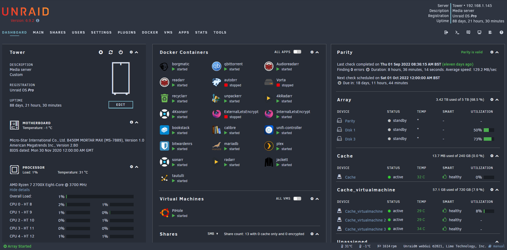
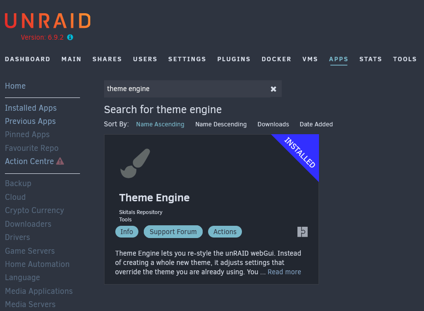

[Theme.Park](https://theme-park.dev/) is a set of custom themes for the common media automation apps. Sonarr, Radarr, Plex, and many more.
For this post we will be applying a theme to unraid taking it from the default theme to the Nord theme. Which looks something similar to:




The first thing we need to do is install the Theme Engine plugin from the Community Applicaitons store. Click Apps and then search for Theme Engine. Install the plugin.



Once installed you can access the Theme Engine settings from Settings > Theme Engine.
From here you will need to:

1. Set the Base Theme to "Black"
2. Enable Advanced View next to Theme Settings
3. Set "Enable Theme Engine" to "No"
4. Set "Enable custome sytling" to "Yes"
5. Add the HTML to the "Custom styling (advanced)" text box at the bottom of the page. 

For the Nord theme you will need to use:
```html
</style>
<link type="text/css" rel="Stylesheet" href="https://theme-park.dev/css/base/unraid/nord.css" />
```

Click Apply, refresh and you should see the new theme being used.
Check out the list of themes at [Theme.Park](https://docs.theme-park.dev/themes/unraid/) - All you need to do to apply a different theme is change ```nord.css``` to theme you want to use like ```overseerr.css```.